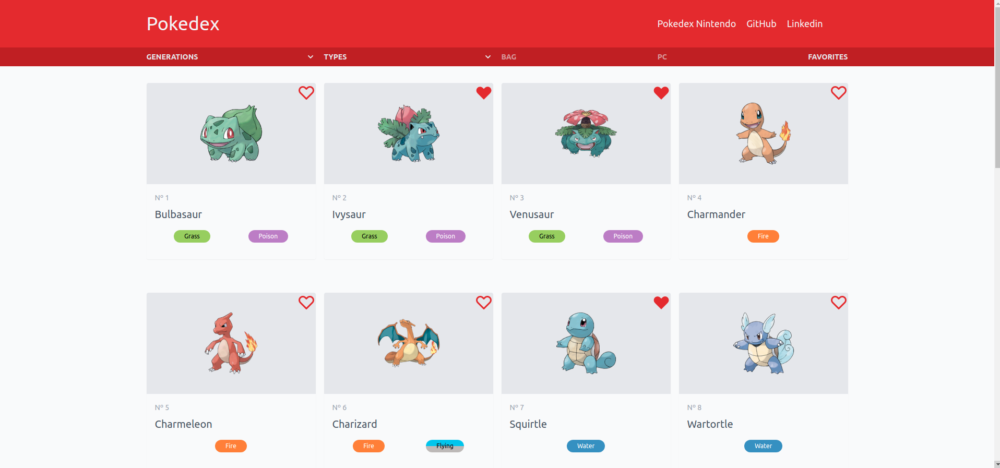
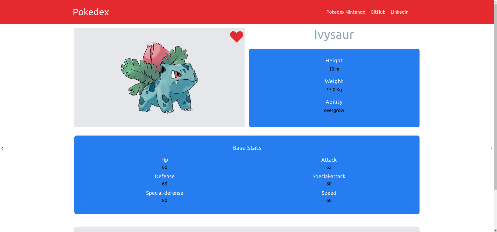
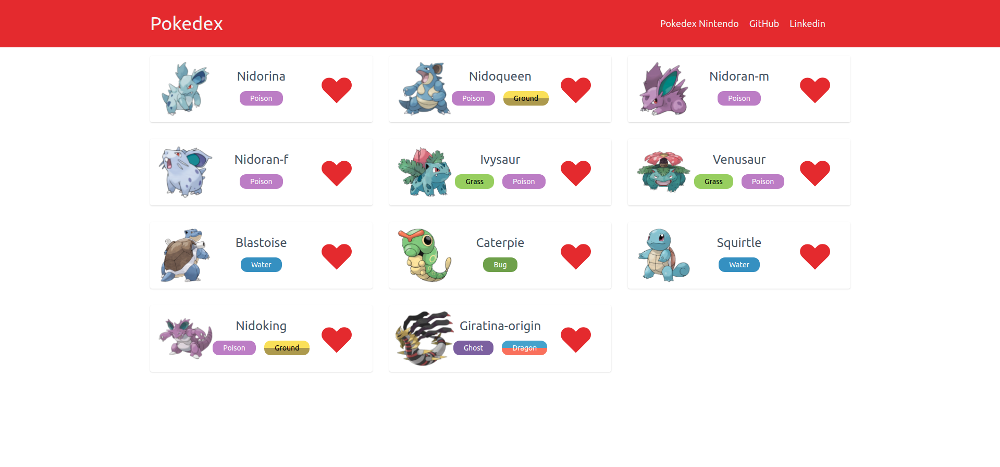

# Pokedex

I started this project to practice and understand how data fetch is done in React.
Today I continue developing it to transform it into a _"real world"_ Pokedex, which I can use as a support tool while I _(or other people)_ play the pokemon games.

## Table of contents

- [Overview](#overview)
  - [The challenge](#the-challenge)
  - [Screenshot](#screenshot)
  - [Links](#links)
- [My process](#my-process)
  - [Built with](#built-with)
  - [What I learned](#what-i-learned)
  - [Continued development](#continued-development)
  - [Useful resources](#useful-resources)
- [Author](#author)

## Overview

### The challenge

1. First version of the Pokedex should
- Render Pokemons dynamically
- Search pokemons by name or id
- Adapt mobile and desktop screens

2. Actual and future versions should
- Have pages containing detailed information about pokemons, items, ability, combos, etc _in construction_
- Store user favorite pokemons, captured pokemons and stored pokemons in Local Storage _in construction_
- Have friendly and intuitive interface
- Have light and Dark Mode _in construction_

### Screenshot

---

---

### Links

- Live site URL: [https://pokedex-app-sandy.vercel.app](https://pokedex-app-sandy.vercel.app)

## My process

### Built with

- React
- React-hooks
- React-Routers
- Redux (RTK)
- Pokenode-ts
- TypeScript
- Tailwind
- Tailwind-Styled-Components

### What I Learned

I started this project to learn about API consuming on React, using class components, JavaScript and Tailwind for styling. In the beginning I learned about life-cycle methods, state management, prop typing with PropTypes and Tailwind CSS _(was my first contact with the framework)_.

Today I use this project to practice general Front-end tools, like Redux, Styled-Components, custom Hooks, TypeScript, etc.

### Continued development

My goal with this project it's to make it a helpfull tool for Pokemon games, containing info about pokemons, items, berrys, routes and moves.

### Useful resources

This project is a inspiration in the [Official Nintendo Pokedex](https://www.pokemon.com/br/pokedex/)

The documentation for some of the technologies that I used:

- [React](https://pt-br.reactjs.org)
- [Redux Tool Kit](https://redux-toolkit.js.org/introduction/getting-started)
- [React-Routers v5](https://v5.reactrouter.com/web/guides/quick-start)
- [Pokenode-ts](https://pokenode-ts-docs-gabb-c.vercel.app)
- [Tailwind v2.2.16](https://v2.tailwindcss.com/docs)
- [Tailwind Styled-Component](https://www.npmjs.com/package/tailwind-styled-components)

## Author

- Linkedin - [Gabriel Silvestre](https://www.linkedin.com/in/gabrielh-silvestre/)
- DevTo - [Gabriel_Silvestre](https://dev.to/gabrielhsilvestre)